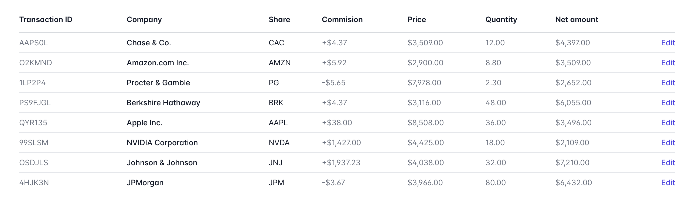

# Transaction Table

You are given a task to generate some finance transactions data in table view. You can see example below:

You can find a fake data in `db.json` file.

Lets create three components:

- `Table` - parent component
  - should have `items` propery
- `TableRow` - one table row
  - should have `item` property for rendering columns
  - should have `row` role attribute
- `TableCell` - one cell in a row
  - should render content via `children`
  - should have `cell` role attribute

## Test Examples

Look at tests for examples
[Table Tests](../../src/components/Table.spec.jsx)
[TableRow Tests](../../src/components/TableRow.spec.jsx)
[TableCell Tests](../../src/components/TableCell.spece.jsx)

/label level::elementary
/label react::component
