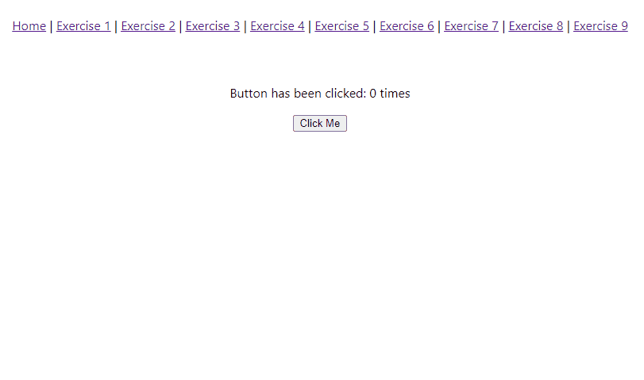

# User Clicks

So you're comfortable working with props, congratulations! Using props allows us to pass values or functions down to a child component.

State is another integral concept we must learn in React. It allows us to store values, and React automatically updates our UI when the values change.

**That's one of the many beautiful things with React.** We don't need to manually handle these things - React does the UI re-rendering for us when a value changes. But we must know how to use the state for this purpose.

This exercise is simple, and is a very common React tutorial out there. Use the `useState` React hook to track how many times a button is clicked, and display the number.
The number must increment each time the button is clicked.

There are two components:

- `Layout`
  - should be rendered in `App.jsx`
  - should contain `Button` component and text
- `Button`
  - should get `className` property
  - should get `onClick` property
  - should contain `title` via `children`

## Test Examples

Look at tests for examples:

- [Button.test.jsx](../../src/components/Button.test.jsx)
- [Layout.test.jsx](../../src/components/Layout.test.jsx)

## Useful links

- [State a Components Memory](https://react.dev/learn/state-a-components-memory)
- [useState](https://react.dev/reference/react/useState)

/label level::elementary
/label react::event
