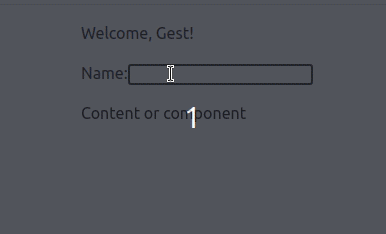

# Welcome page

So you already know how to work with state and use hook useState. Try using them to work with forms. An input like `<input />` is uncontrolled. Even if you [pass an initial value](https://react.dev/reference/react-dom/components/input#providing-an-initial-value-for-an-input) like `<input defaultValue="Initial text" />`, your JSX only specifies the initial value. It does not control what the value should be right now.

To render a controlled input, pass the value prop to it (or checked for checkboxes and radios). React will force the input to always have the value you passed. Usually, you would do this by declaring a [state variable](https://react.dev/reference/react/useState)

You also need to make a Layout component that will wrap other components. Inside the `<Layout/>` you should have two blocks. One block displays welcome text (`Welcome, Gest!` or `Welcome, {username}!` ), which will be the same for all pages wrapped by the `<Layout/>` component. The other block will display any content that we wrap with the  component (`<Layout> Content </Layout`)

- [ ] Create a Layout component that will wrap other components. The Layout should consist of two blocks: header and main.
- [ ] Main should contain the passed content.
- [ ] Create for entering a name and connecting it to the state.
- [ ] The welcome text is rendered in the header: *"Welcome, {username}!"*. If no username is passed, display the default value *"Welcome, Guest!"*

## Useful links

- [UseState](https://react.dev/reference/react/useState)

/label level::elementary
/label react::component
/label react::state
