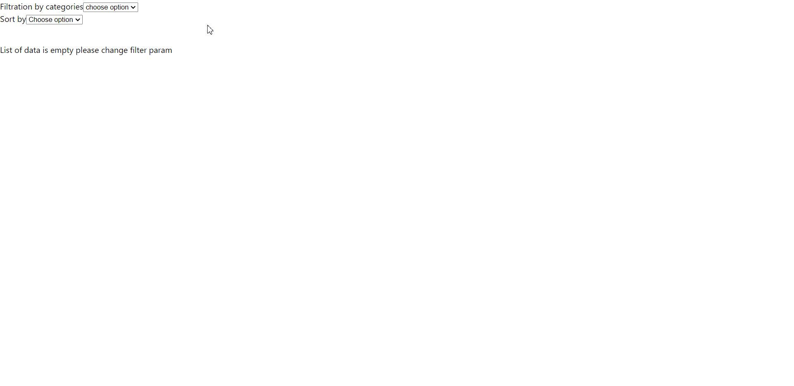

# Render data with sorting and filtering

In this task you need to write logic that make sorting, filtration and return corresponding data from `DUMMY_DATA`.

- Make filtration by `category`
- Make sorting by `price/rating` from bottom to top
- Use `SingleCard` component for rendering data

Filtering must work like this:

- You select option `Outdoors` and on the page appear only items with category `Outdoors`
- You select option `Tools` and on the page appear only items with category `Tools`
- You select option `Films` and on the page appear only items with category `Films`
- If list of data is empty, you must render next part of code:

```jsx
<p data-testid="empty-message">List of data is empty please change filter param</p>
```

Sorting must work like this:

- You select `option price` and we must see sorted data by price from the `lowest` value to the `highest` value
- The same behavior with `option rating`

## Example of work



## Useful links

- [filter()](https://developer.mozilla.org/en-US/docs/Web/JavaScript/Reference/Global_Objects/Array/filter)
- [sort()](https://developer.mozilla.org/en-US/docs/Web/JavaScript/Reference/Global_Objects/Array/sort)
- [useEffect](https://react.dev/reference/react/useEffect)
- [useState](https://react.dev/reference/react/useState)

/label level::elementary
/label react:component
