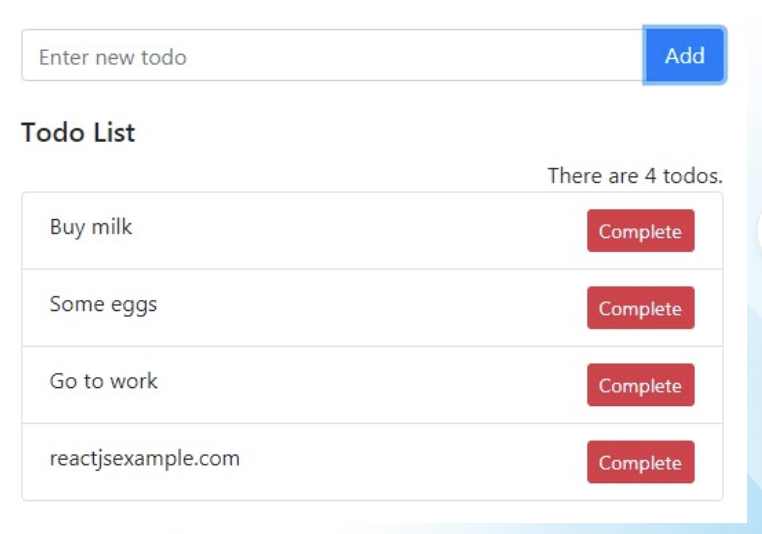

# Create Todo List app using React.js

Your task is to create a simple todo application using functional components in React.js. 
The application should have an input field where users can enter their tasks, 
an "Add" button to add the task to the todo list, 
and a "Complete" button to mark a task as completed.

## Instructions:

1. Create a new React component called "TodoApp".
2. Initialize a state variable, "tasks", as an empty array to hold the list of tasks.
3. Create an input field where users can enter their tasks. The input must have a `placeholder='Enter new todo'` like as a picture
4. Create an "Add" button that, when clicked, adds the entered task to the "tasks" state.
5. Display the list of tasks on the screen.
6. For each task, display a "Complete" button.
7. When the "Complete" button is clicked, remove the corresponding task from the list of tasks.
8. Style the todo application as per your preference.

Note:
- You can use any CSS framework or write custom CSS to style the application.
- Make sure your solution is well-structured and follows best practices for React development.

Good luck!

### Useful links

- [Handling Events](https://react.dev/learn/responding-to-events)
- [Controlled vs. uncontrolled components in React](https://blog.logrocket.com/controlled-vs-uncontrolled-components-in-react/)

/label level::elementary
/label react::component
