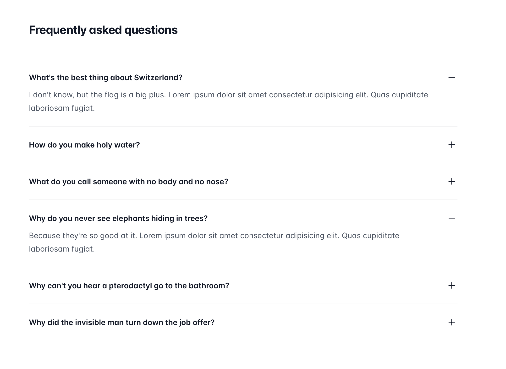

# Frequently asked questions

Create a React component that displays a list of frequently asked questions (FAQs). The component should allow the user to click on a question to reveal its answer. The answer should be hidden by default, and should slide down when the question is clicked.

There should be at minimum two main components:

- `FAQList`
  - should have a `items` property with questions ans answers
- `FAQItem`
  - should have two properties: `question` and `answer`
  - create `show/hide` functionality via `display: block/none` style property

## Test Examples

Look at tests for examples

- [src/components/FAQList.spec.jsx](../../src/components/FAQList.test.jsx)

- [src/components/FAQItem.spec.jsx](../../src/components/FAQItem.test.jsx)

/label level::elementary
/label react::component
/label react::state
/label react::event
