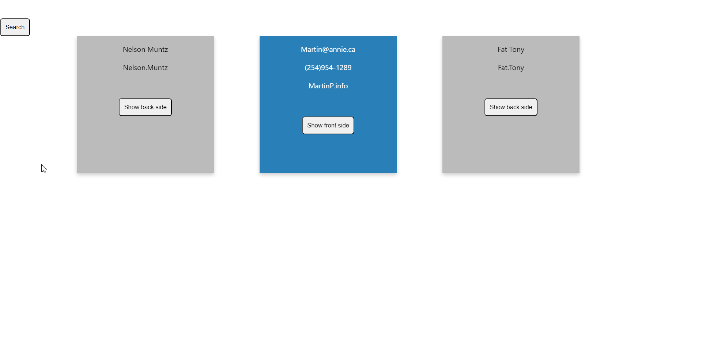

# Working with an api

Before starting work with this task you need to start  App. For starting App you need to do next steps:

- start server with command - `yarn server`
- start our App with command - `yarn dev`

If you don't know how you can split terminal in your `IDE`, look at this link

- [split terminal](https://code.visualstudio.com/docs/terminal/basics)

In this task we will work with typically situation in react e.g. get data from internal API.
You need to get 3 random users from this api `http://localhost:3004/users` in 2 cases:

- When component App was mount
- Every times when we press button `Search`(didUpdate)

**IMPORTANT You must get request to API with random ids. Don't get random
  users ar the client side of app**

## Additional tasks

- Create `Card` component that gets nex props: `name, username, email, phone, website` **don't forget about proptypes**
- Front side of card **active by default** shows `name`, `username` and `button` with text `Show back side`
- When press button `Show back side` we must see **back** side of card and don't see **front** side
- Back side of card shows `email`, `phone`, `website` and `button` with text `Show front side`
- When press button `Show front side` we must see **front** side of card and don't see **back** side

## Test Examples

Look at tests for examples

[App](../../src/App.test.jsx)
[Card](../../src/components/Card/Card.test.jsx)

## Example of work

### Useful links

- [useEffect](https://react.dev/reference/react/useEffect)
- [Events](https://react.dev/learn/responding-to-events#adding-event-handlers)
- [Conditional rendering](https://react.dev/learn/conditional-rendering)
- [json-server](https://github.com/typicode/json-server)
- [json-server filtering](https://github.com/typicode/json-server#filter)

/label level::elementary
/label react::component
/label react::hook
/label react::event
