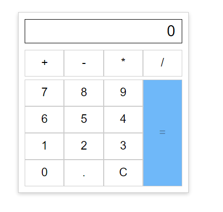

# UseReducer calculator

Your task is create simple calculator. You need to use `useReducer` hook for manipulation value of states.

## Acceptation Criteria

- Calculator must be like this

- Add `plus` functionality:
  - 1 + 5 = 6
  - 0.1 + 0.2 = 0.3

- Add `minus` functionality:
  - 6 - 2 = 4
  - 0.6 - 0.2 = 0.4

- Add `divide` functionality:
  - 56 / 7 = 8
  - 0.56 / 0.7 = 0.8

- Add `multiply` functionality:
  - 7 * 8 = 56
  - 0.7 * 0.8 = 0.56

- Add part(display) of code that shows numbers that was typed. Add attribute for this part `data-testid="display"`
- Add `data-testid="zero-button"` to zero calculator button  
- Add button `C`. This button clears all value from display when button was pressed. Add attribute `data-testid="clear"`

### Useful links

- [useReducer](https://react.dev/reference/react/useReducer)

/label level::elementary
/label react::component
/label react::hook
