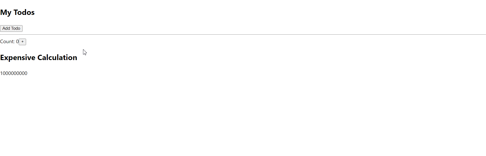

# useMemo

Each programmer faces a performance issue. From time to time, React components have to perform expensive calculations. For example, given an extensive list of employees and a search query, the component should filter the employees' names by the query.

In such cases, with care, you can try to improve the performance of your components using the **memoization** technique.

## Performance

The useMemo Hook can be used to keep expensive, resource-intensive functions from needlessly running.
In the attached example, we have an expensive function that runs on every render.
When changing the count or adding a todo, you will notice a delay in execution

## Task

Fix this performance issue with the useMemo Hook and compare calls of the expensiveCalculation function when you add a todo

```jsx
import { useState } from 'react'

const expensiveCalculation = (num) => {
  for (let i = 0; i < 1000000000; i++) {
    num += 1
  }
  return num
}

const App = () => {
  const [count, setCount] = useState(0)
  const [todos, setTodos] = useState([])
  const calculation = expensiveCalculation(count)

  const increment = () => {
    setCount((c) => c + 1)
  }

  const addTodo = () => {
    setTodos((t) => [...t, 'New Todo'])
  }

  return (
    <div>
      <div>
        <h2>My Todos</h2>
        {todos.map((todo, index) => {
          return (
            <p key={index} data-testid="todo-item">
              {todo}
            </p>
          )
        })}
        <button onClick={addTodo}>Add Todo</button>
      </div>
      <hr />
      <div>
        Count: <span data-testid="count">{count}</span>
        <button onClick={increment}>+</button>
        <h2>Expensive Calculation</h2>
        {calculation}
      </div>
    </div>
  )
}

export default App
```

## How it works now


## How it must work



## Helpful links

* [useMemo](https://react.dev/reference/react/useMemo)
