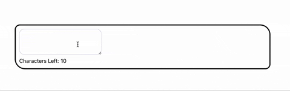

# Ref Character Countdown

In this task, you will work with the useRef hook to build a character countdown that displays the number of remaining characters the user can enter in a text input field.

- Set up a React project and create a component that includes a text (add an attribute `data-testid="input-field"` for it) input field and a countdown display. Use the useRef hook to create a reference to the text input element.
- Implement an event handler that listens to changes in the text input field.
Within the event handler, access the current value of the text input field using the reference created with useRef.
- Calculate the length of the entered text and subtract it from the maximum character limit to determine the remaining character count.
- Update the countdown display with the current remaining character count.
- Render the text input field and the countdown display in your component, ensuring they are visually appealing and properly styled.
- **Message must be a separate message**

## Optional

Enhance the character countdown by adding a maximum character limit and displaying a warning when the limit is reached or exceeded.

## Example

## Useful links

- [React docs: useRef](https://react.dev/reference/react/useRef)
  
/label level::elementary
/label react::component
